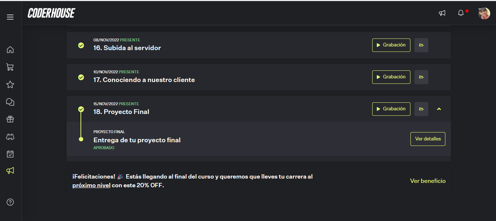
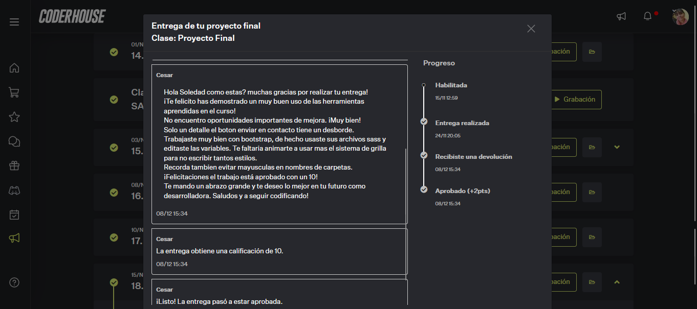
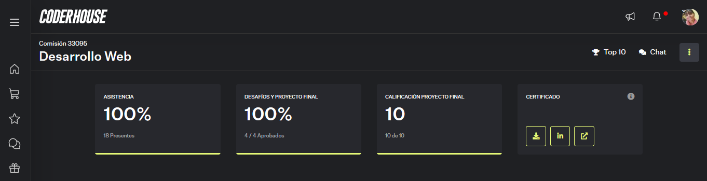
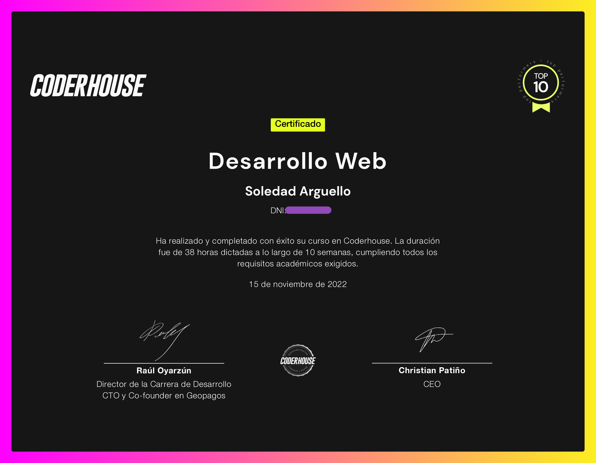

# LulyNais Salon de Uñas

   Es un proyecto real que me propuse realizar para el salon de uñas de una amiga y con motivo de rendir 
   un examen en la academia Coder House, como proyecto integrador de lo visto a lo largo de dos meses.
     Donde vimos Html5, Css3, box modelin, flexbox, Grid, bootstrap, Sass, SEO, Dominio y Hosting.
    
### DEMO GitHub: https://sole-arguello.github.io/LulyNails/
### DEMO Netlify: https://jade-pixie-017d25.netlify.app/    

## Tecnologias Utilizadas:
<li>Html5</li>
<li>Css (bootstrap - Sass(SCCSS))</li>
<li>Node.Js</li>
<li>Responsive Movil First</li>
<li>Subido al Hosting GitHub y Netlify</li>

## Temas Vistos:
   15. Subida al servidor
   16. Conociendo a nuestro cliente
   17. Proyecto Final
   
### Nota Obtenida y Devolucion: 

### Certificado y Evolucion: 

